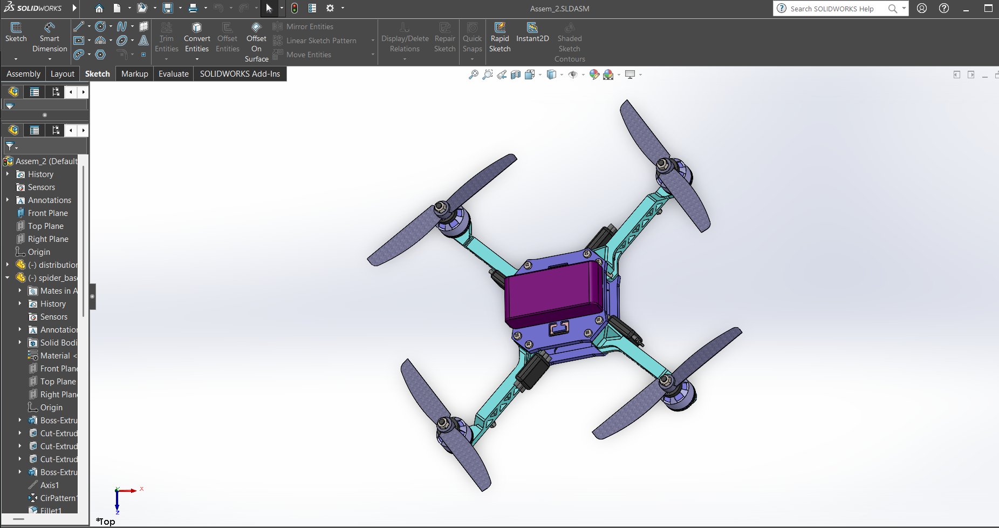
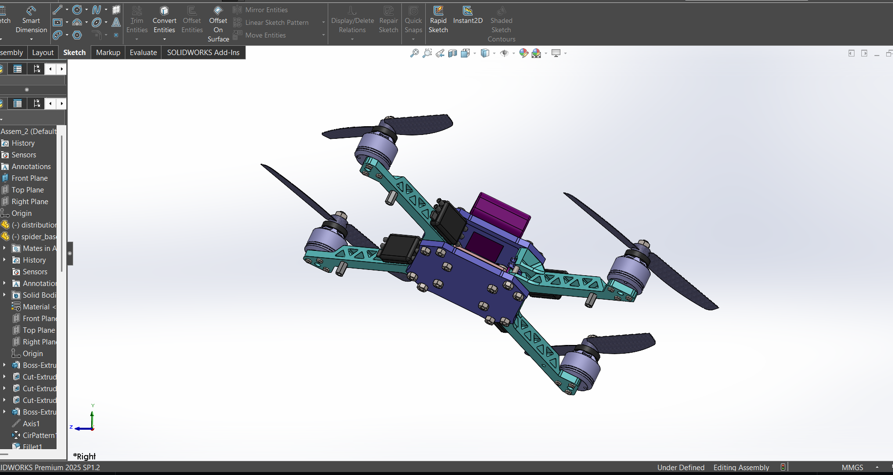
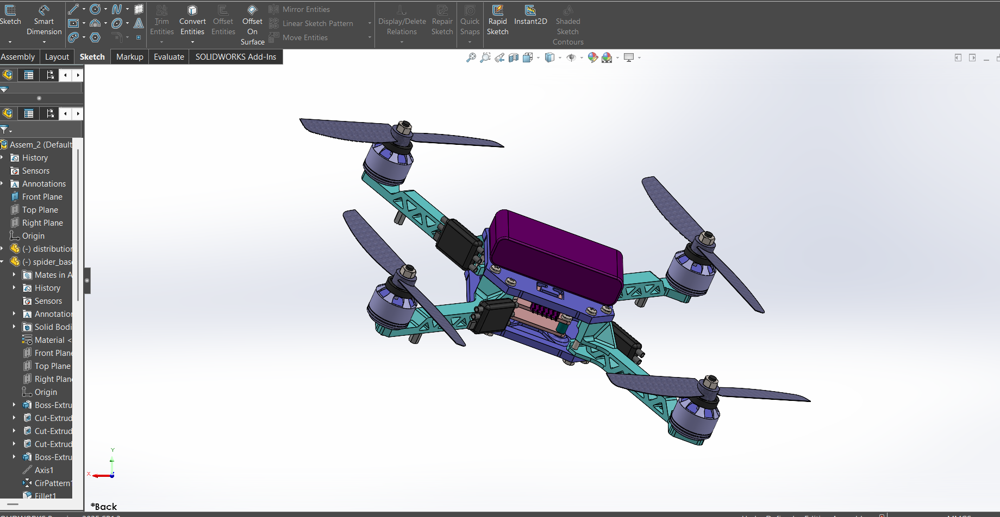

# 🚁 Drone Design (SolidWorks)

## 📌 Overview

This project is a 3D CAD model of a drone designed using SolidWorks. It includes detailed parts, assembly, and export files for visualization.

## 🛠️ Tools Used

* SolidWorks

## 📂 Project Structure

* Parts (.SLDPRT)
* Assembly (.SLDASM)
* Drawings (.SLDDRW)
* Export files (.STEP / .STL)

## 📸 Preview

## 📸 Preview

## 🎯 Purpose

This project was created to practice mechanical design, assembly, and understanding of drone structure.

## ⚠️ Note

This design is recreated for learning purposes.
